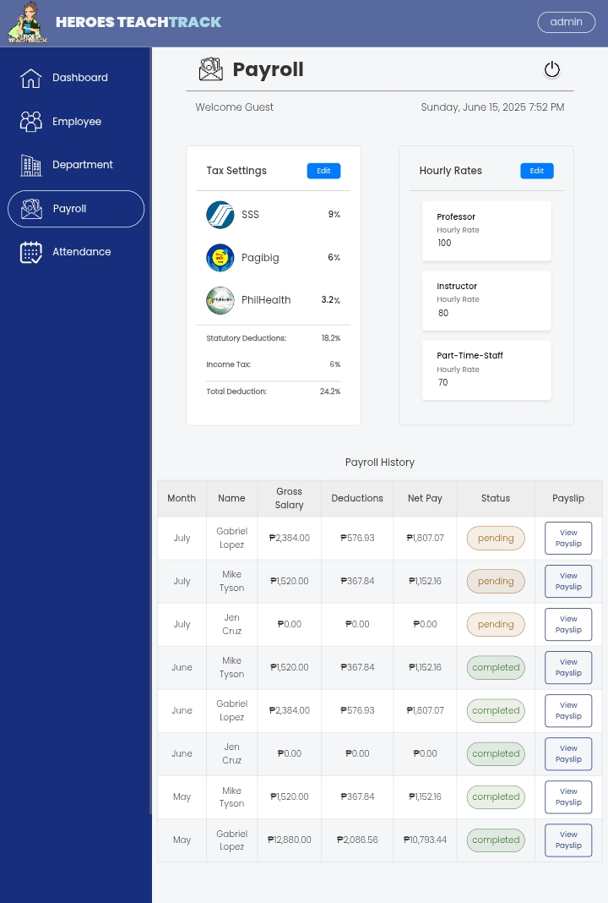
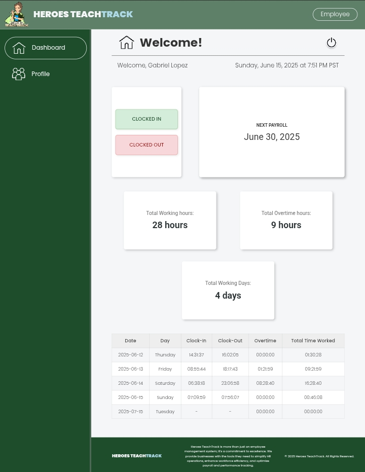

<!-- Banner -->
<p align="center">
  
</p>

<h1 align="center">📊 Accounting Management System</h1>
<p align="center">
  A powerful web-based platform for handling payroll, employee attendance, department management, and automated payslip generation.
</p>

<p align="center">
  
  
  
</p>

---

## 🧠 Tech Stack

<p align="center">
  
  
  
  
  
</p>

---

## 🔥 Key Features

✅ **Payroll System** — Automated payroll calculations based on attendance and rates  
✅ **Payslip Generation** — Instantly downloadable payslips for each employee  
✅ **Attendance Tracking** — Real-time clock-in and clock-out system  
✅ **Taxation Handling** — Deductions based on tax configuration  
✅ **Hourly Rate Computation** — For both part-time and full-time staff  
✅ **Department Management** — Add, edit, or delete departments  
✅ **Employee Management** — Edit info, activate/deactivate/reactivate accounts  
✅ **Smart Filtering & Search** — Filter by department, status, and name search  

---

## 📸 Screenshots

### 🛠️ Admin Dashboard
<p align="center">
  
  <br><i>Admin view with control over departments, payroll, and employees</i>
</p>

### 👷 Employee Dashboard
<p align="center">
  
  <br><i>Employee view with attendance and payslip access</i>
</p>

---

## 🛠️ How to Set Up

```bash
# Clone the repo
git clone https://github.com/Jahmiebelle/Accounting-Management-System.git

# Move into the project
cd Accounting-Management-System/AccountingSys

# Place in XAMPP/Laragon's www or htdocs directory

# Import the SQL database via phpMyAdmin or CLI

# Visit in your browser:
http://localhost/Accounting-Management-System/AccountingSys/